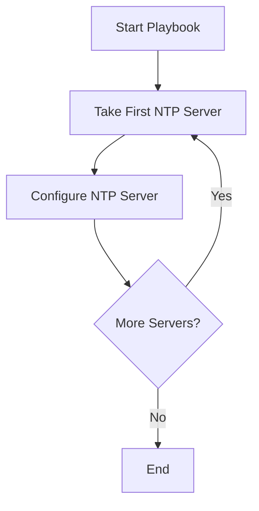
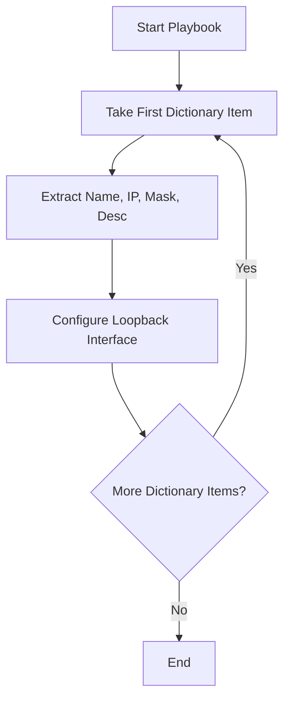
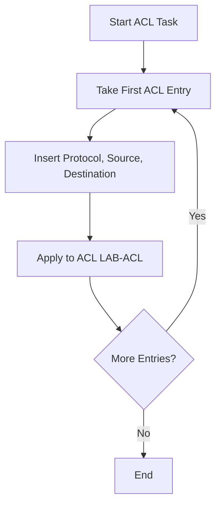
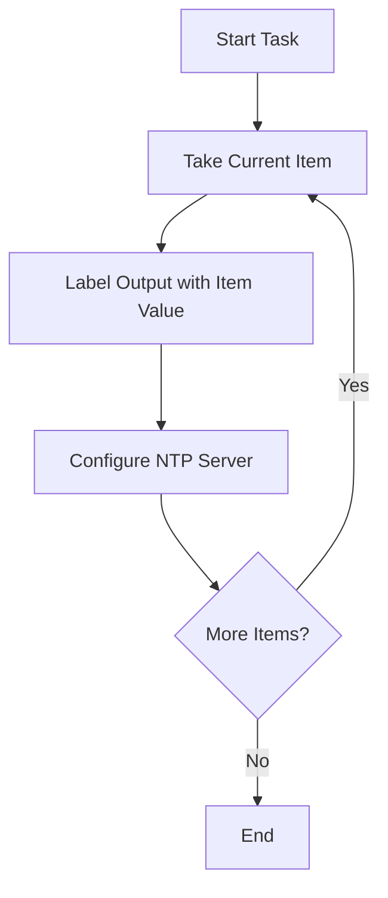

# Lab – IOS-XE Playbooks with Loops

---

## Introduction

In Ansible, **loops** allow you to repeat tasks across a set of items instead of writing the same YAML multiple times. This is powerful when configuring IOS-XE devices that often require repetitive tasks: adding interfaces, NTP servers, or ACLs.

In this lab, we will explore loops in **three levels of complexity**:

1. **Simple loops with lists** (one value per iteration)
2. **Dictionary loops** (multiple parameters per item)
3. **Structured loops for complex configurations** (ACLs)
4. **Bonus – loop\_control** (making loops easier to debug and understand)

---

## Objectives

* Learn what loops are and why they matter
* Configure multiple NTP servers using a simple loop
* Configure multiple interfaces with dictionaries
* Build ACLs with loops
* Use `loop_control` to improve debugging output

---

## Lab Steps

### Step 1 – Simple Loop Example (Lists)

**Create/Edit the file with nano:**

```bash
nano ntp_loop.yml
```

```yaml
- name: Configure NTP servers
  hosts: csr
  gather_facts: no
  connection: network_cli
  vars:
    ansible_become: yes
    ansible_become_method: enable
    ansible_become_password: cisco

  tasks:
    - name: Configure multiple NTP servers with a loop
      cisco.ios.ios_config:
        lines:
          - ntp server {{ item }}
      loop:
        - 192.168.56.100
        - 192.168.56.101
        - 192.168.56.102
```

**Run the playbook:**

```bash
ansible-playbook -i inventory.txt ntp_loop.yml
```

**Flowchart of Loop Execution:**



---

### Step 2 – Dictionary Loop (Multiple Parameters)

**Create/Edit the file with nano:**

```bash
nano loopback_interfaces.yml
```

```yaml
- name: Configure Loopback interfaces
  hosts: csr
  gather_facts: no
  connection: network_cli
  vars:
    ansible_become: yes
    ansible_become_method: enable
    ansible_become_password: cisco

  tasks:
    - name: Configure multiple Loopback interfaces using a loop
      cisco.ios.ios_config:
        lines:
          - ip address {{ item.ip }} {{ item.mask }}
          - description {{ item.desc }}
        parents: "interface {{ item.name }}"
      loop:
        - { name: Loopback10, ip: 10.11.10.1, mask: 255.255.255.0, desc: "Configured by Ansible - Loopback10" }
        - { name: Loopback20, ip: 10.21.20.1, mask: 255.255.255.0, desc: "Configured by Ansible - Loopback20" }
        - { name: Loopback30, ip: 10.31.30.1, mask: 255.255.255.0, desc: "Configured by Ansible - Loopback30" }
```

**Run the playbook:**

```bash
ansible-playbook -i inventory.txt loopback_interfaces.yml
```

**Flowchart of Dictionary Loop Execution:**



---

### Step 3 – Advanced Loop (Structured Configurations)

**Create/Edit the file with nano:**

```bash
nano acl_loop.yml
```

```yaml
- name: Configure ACL
  hosts: csr
  gather_facts: no
  connection: network_cli
  vars:
    ansible_become: yes
    ansible_become_method: enable
    ansible_become_password: cisco

  tasks:
    - name: Configure ACL entries using loop
      cisco.ios.ios_config:
        lines:
          - permit {{ item.protocol }} {{ item.source }} {{ item.destination }}
        parents: "ip access-list extended LAB-ACL"
      loop:
        - { protocol: ip, source: 10.10.10.0 0.0.0.255, destination: any }
        - { protocol: ip, source: 10.20.20.0 0.0.0.255, destination: any }
```

**Run the playbook:**

```bash
ansible-playbook -i inventory.txt acl_loop.yml
```

**Flowchart of ACL Loop Execution:**



---

### Step 4 – Bonus: Using `loop_control`

**Create/Edit the file with nano:**

```bash
nano ntp_loop_control.yml
```

```yaml
- name: Configure NTP with loop_control
  hosts: csr
  gather_facts: no
  connection: network_cli
  vars:
    ansible_become: yes
    ansible_become_method: enable
    ansible_become_password: cisco

  tasks:
    - name: Configure multiple NTP servers with loop_control
      cisco.ios.ios_config:
        lines:
          - ntp server {{ item }}
      loop:
        - 192.168.56.100
        - 192.168.56.101
        - 192.168.56.102
      loop_control:
        label: "{{ item }}"
```

**Run the playbook:**

```bash
ansible-playbook -i inventory.txt ntp_loop_control.yml
```

**Flowchart of Loop with `loop_control`:**



---

## Deliverables

By the end of this lab, you should be able to:

* Use `nano` to create and edit YAML playbooks
* Use a working `inventory.txt` file to define your CSR device
* Run playbooks with `ansible-playbook -i inventory.txt <filename>.yml`
* Explain the benefits of loops in Ansible
* Use **list loops**, **dictionary loops**, and **structured loops** for CSR devices
* Apply `loop_control` for easier debugging

---
