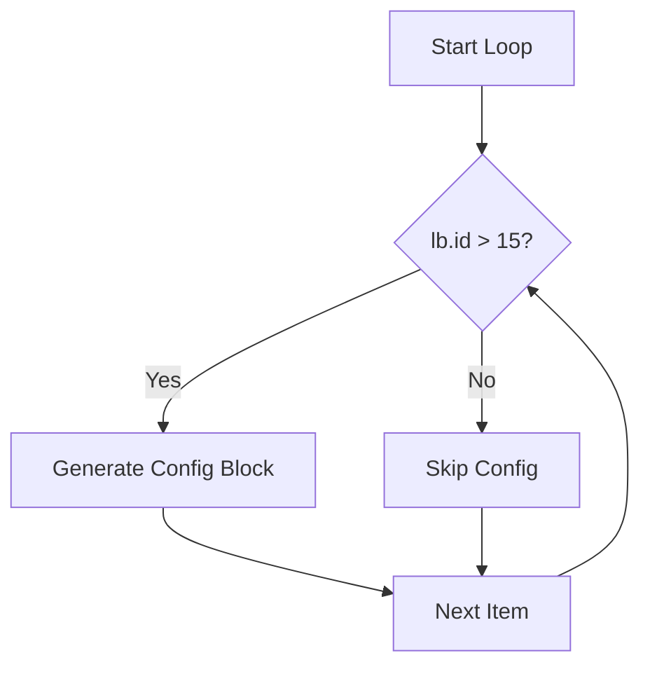
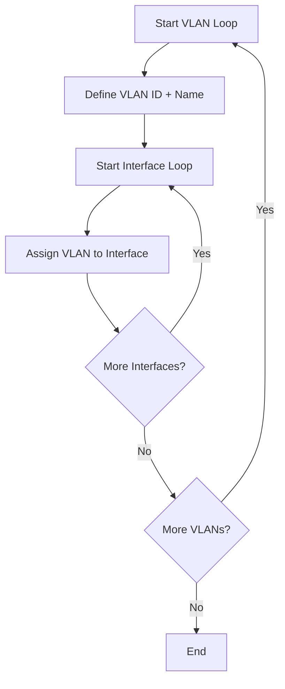

# Lab – IOS-XE Playbooks with Jinja2 Templating

## Introduction

Jinja2 is the **templating engine** built into Ansible. It allows you to stop writing rigid, one-off configurations and instead design **blueprints** that adapt automatically to different devices.

With Jinja2 you can:

* Use **variables** to insert dynamic values (e.g., hostnames, IPs).
* Use **loops** to repeat sections of configuration automatically.
* Use **conditionals** to generate config only when rules are met.

This transforms your playbooks from static scripts into **scalable, intelligent automation frameworks**.

---

## Lab 1 – Simple Variable Substitution

### Goal

Introduce variables so configs are reusable. Instead of changing hostnames or banners in the template itself, you only update the variables file.

1. Create the variables file:

```bash
nano vars_lab1.yml
```

```yaml
hostname: CSR-TEMPLATE
banner_message: "Welcome to CSR Router - Managed by Ansible Jinja2"
```

2. Create the template file:

```bash
nano lab1_template.j2
```

```jinja
hostname {{ hostname }}

banner motd ^C
{{ banner_message }}
^C
```

3. Create the playbook:

```bash
nano jinja2_lab1.yml
```

```yaml
---
- name: Jinja2 Lab 1 - Variable Substitution
  hosts: csr
  gather_facts: no
  connection: network_cli
  vars_files:
    - vars_lab1.yml
  vars:
    ansible_become: yes
    ansible_become_method: enable
    ansible_become_password: cisco

  tasks:
    - name: Render template
      template:
        src: lab1_template.j2
        dest: rendered_lab1.txt

    - name: Apply config
      ios_config:
        src: rendered_lab1.txt
```

4. Run the playbook:

```bash
ansible-playbook -i inventory.txt jinja2_lab1.yml
```

**Information:**
This teaches the principle of *separating logic from data*. The `lab1_template.j2` is reusable, and you can build dozens of configs just by swapping the variable file.

**Validation:**

```bash
show running-config | include hostname
show running-config | section banner
```

---

## Lab 2 – Loops in Jinja2

### Goal

Show how loops generate repetitive sections (like loopback interfaces).

1. Create the variables file:

```bash
nano vars_lab2.yml
```

```yaml
loopbacks:
  - { id: 10, ip: 10.10.10.1, mask: 255.255.255.0 }
  - { id: 20, ip: 10.20.20.1, mask: 255.255.255.0 }
```

2. Create the template:

```bash
nano lab2_template.j2
```

```jinja

interface Loopback{{ lb.id }}
 ip address {{ lb.ip }} {{ lb.mask }}
 description Configured by Jinja2 loop

```

3. Create the playbook:

```bash
nano jinja2_lab2.yml
```

```yaml
---
- name: Jinja2 Lab 2 - Loops
  hosts: csr
  gather_facts: no
  connection: network_cli
  vars_files:
    - vars_lab2.yml
  vars:
    ansible_become: yes
    ansible_become_method: enable
    ansible_become_password: cisco

  tasks:
    - name: Render template
      template:
        src: lab2_template.j2
        dest: rendered_lab2.txt

    - name: Apply config
      ios_config:
        src: rendered_lab2.txt
```

4. Run it:

```bash
ansible-playbook -i inventory.txt jinja2_lab2.yml
```

**Information:**
Loops allow data-driven scalability. Instead of writing the same config three times, you define the data and let Jinja2 render it.

**Validation:**

```bash
show ip interface brief | include Loopback
```

---

## Lab 3 – Conditionals in Jinja2

### Goal

Teach decision-making logic inside templates.

1. Variables file:

```bash
nano vars_lab3.yml
```

```yaml
loopbacks:
  - { id: 10, ip: 10.10.10.1, mask: 255.255.255.0 }
  - { id: 20, ip: 10.20.20.1, mask: 255.255.255.0 }
```

2. Template file:

```bash
nano lab3_template.j2
```

```jinja


interface Loopback{{ lb.id }}
 ip address {{ lb.ip }} {{ lb.mask }}
 description Configured only when ID > 15


```

3. Playbook:

```bash
nano jinja2_lab3.yml
```

```yaml
---
- name: Jinja2 Lab 3 - Conditionals
  hosts: csr
  gather_facts: no
  connection: network_cli
  vars_files:
    - vars_lab3.yml
  vars:
    ansible_become: yes
    ansible_become_method: enable
    ansible_become_password: cisco

  tasks:
    - name: Render template with conditionals
      template:
        src: lab3_template.j2
        dest: rendered_lab3.txt

    - name: Apply config
      ios_config:
        src: rendered_lab3.txt
```

4. Run it:

```bash
ansible-playbook -i inventory.txt jinja2_lab3.yml
```

**Information:**
Now the template doesn’t blindly apply configs. It “thinks”: only loopbacks with IDs greater than 15 are configured.

**Logic Flow Diagram:**



**Validation:**

```bash
show ip interface brief | include Loopback
```

Only Loopback20 should be created.

---

## Lab 4 – Combining Variables, Loops, and Conditionals

### Goal

Build a complete, dynamic device config that adapts to different roles.

1. Variables file:

```bash
nano vars_lab4.yml
```

```yaml
hostname: CSR-COMPLEX
banner_message: "Dynamic Config with Jinja2"
ntp_enabled: true
loopbacks:
  - { id: 30, ip: 10.30.30.1, mask: 255.255.255.0 }
  - { id: 40, ip: 10.40.40.1, mask: 255.255.255.0 }
```

2. Template:

```bash
nano lab4_template.j2
```

```jinja
hostname {{ hostname }}

banner motd ^C
{{ banner_message }}
^C


ntp server 192.168.56.200



interface Loopback{{ lb.id }}
 ip address {{ lb.ip }} {{ lb.mask }}
 description Configured by advanced Jinja2 template

```

3. Playbook:

```bash
nano jinja2_lab4.yml
```

```yaml
---
- name: Jinja2 Lab 4 - Combined Features
  hosts: csr
  gather_facts: no
  connection: network_cli
  vars_files:
    - vars_lab4.yml
  vars:
    ansible_become: yes
    ansible_become_method: enable
    ansible_become_password: cisco

  tasks:
    - name: Render combined template
      template:
        src: lab4_template.j2
        dest: rendered_lab4.txt

    - name: Apply rendered config
      ios_config:
        src: rendered_lab4.txt
```

Run it:

```bash
ansible-playbook -i inventory.txt jinja2_lab4.yml
```

**Information:**
This template integrates everything. It applies hostname and banners universally, creates loopbacks based on data, and conditionally enables NTP if the flag is set. This is close to real production automation.

**Validation:**

```bash
show run | include hostname
show run | include ntp
show ip interface brief | include Loopback
```

---

## Lab 5 – Nested Loops (Stretch Task)

### Goal

Practice hierarchical data structures with nested loops.

```bash
nano nested_template.j2
```

```jinja

vlan {{ vlan.id }}
 name {{ vlan.name }}

interface {{ intf }}
 switchport access vlan {{ vlan.id }}


```

**Information:**
This is how you handle multi-level configurations (VLANs with interfaces, ACLs with multiple rules, VRFs with routes, etc.).

**Logic Flow Diagram:**



---

## Deliverables

By completing this progression, you will:

* Understand and use **variables, loops, and conditionals** in Jinja2.
* Write templates that scale across many routers.
* Render and review configs before applying them.
* Build reusable templates for real-world IOS-XE automation.

---

✨ **Key Takeaway:**
Jinja2 shifts automation from writing **static configs** to writing **rules that generate configs**. With one smart template and multiple variable files, you can automate entire networks at scale.

---
