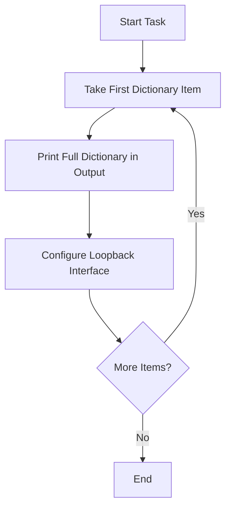
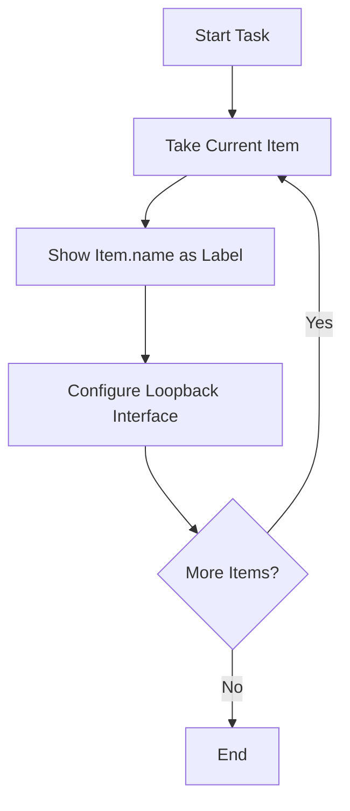

# Lab – IOS-XE Playbooks with `loop_control`

## Introduction

When you run a loop in Ansible, the output shows every iteration. By default, Ansible prints the **entire data structure** for each item in the loop (which can be long and messy if you’re looping over dictionaries).

This makes it hard to read and debug, especially if you’re looping through:

* Dozens of interfaces with multiple parameters
* Complex ACL entries
* Device lists with long dictionaries

The **`loop_control`** keyword gives you control over how Ansible **labels and displays each iteration** in the output. This is especially useful in training environments (to help learners see what’s happening) and in production (to quickly spot errors).

---

## Objectives

* Learn the purpose of `loop_control`
* Use `loop_control` with `label` to customize task output
* Understand how `loop_control` improves readability and debugging
* Compare output with and without `loop_control`

---

## Lab Steps

### Step 1 – Default Loop Behavior

Create `loopcontrol_lab.yml` with this task:

```yaml
---
- name: Loop Control Lab - Default Behavior
  hosts: csr
  gather_facts: no
  connection: network_cli
  vars:
    ansible_become: yes
    ansible_become_method: enable
    ansible_become_password: cisco

  tasks:
    - name: Configure interfaces (default loop output)
      cisco.ios.ios_config:
        lines:
          - ip address {{ item.ip }} {{ item.mask }}
          - description {{ item.desc }}
        parents: "interface {{ item.name }}"
      loop:
        - { name: Loopback80, ip: 10.80.80.1, mask: 255.255.255.0, desc: "Configured with default loop" }
        - { name: Loopback90, ip: 10.90.90.1, mask: 255.255.255.0, desc: "Configured with default loop" }
```

**Information:**
This playbook configures two loopback interfaces. When you run it, Ansible will display the entire dictionary for each loop iteration, such as `{ name: Loopback80, ip: 10.80.80.1, ... }`. This shows all the variables being used but can be cluttered when dealing with many items.

**Flowchart of Default Loop Execution:**



---

### Step 2 – Using `loop_control` with `label`

Now add another task in the same playbook using `loop_control`:

```yaml
    - name: Configure interfaces (clean output with loop_control)
      cisco.ios.ios_config:
        lines:
          - ip address {{ item.ip }} {{ item.mask }}
          - description {{ item.desc }}
        parents: "interface {{ item.name }}"
      loop:
        - { name: Loopback100, ip: 10.100.100.1, mask: 255.255.255.0, desc: "Configured with loop_control" }
        - { name: Loopback110, ip: 10.110.110.1, mask: 255.255.255.0, desc: "Configured with loop_control" }
      loop_control:
        label: "{{ item.name }}"
```

**Information:**
Here, the `loop_control` keyword is added with the `label` option. Instead of printing the full dictionary, the output now shows only the interface name. This makes the console output shorter, clearer, and more focused.

**Flowchart of Loop with `loop_control`:**



---

### Step 3 – Run the Playbook

Execute the playbook:

```bash
ansible-playbook -i inventory.txt loopcontrol_lab.yml
```

**Information:**
When this playbook runs, the first task shows long dictionary outputs, while the second (with `loop_control`) displays only the chosen label. Comparing both makes it clear how `loop_control` improves readability.

---

### Step 4 – Validate on the Router

Check the new interfaces:

```bash
show ip interface brief | include Loopback
```

**Information:**
You should see four new loopback interfaces: Loopback80, Loopback90, Loopback100, and Loopback110. This confirms that both tasks successfully applied the configurations. `loop_control` does not change what happens on the router — it only changes how the process is displayed to you.

---

## Deliverables

By the end of this lab, you should be able to:

* Recognize default loop output in Ansible
* Use `loop_control` to label iterations with a meaningful identifier
* Understand why `loop_control` makes playbook output easier to read and debug
* Confirm IOS-XE interfaces were configured correctly

---

---

✨ **Key takeaway:** `loop_control` improves how loop results are presented. It provides a cleaner, more human-readable format that makes debugging easier and progress more obvious when working with larger data sets.
