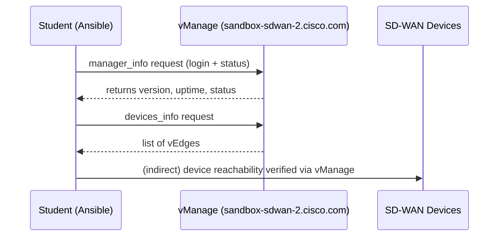

# Lab 1 – Basic Connectivity Check (NEW, Enhanced)

## 📘 Introduction  
In this first lab, you’ll begin working with **Ansible and Cisco Catalyst SD-WAN (vManage)**. Before diving into advanced automation, it’s essential to prove that Ansible can successfully talk to vManage. This lab focuses on establishing that baseline connectivity by logging in, checking vManage’s status, and retrieving a list of devices.  

We will connect to a Cisco DevNet sandbox vManage instance:  

- 🌐 **Server:** `sandbox-sdwan-2.cisco.com`  
- 👤 **Username:** `admin`  
- 🔑 **Password:** `Cisco12345`  

⚠️ *Important note:* In production, you would **never** store credentials in plain text. You’d use Ansible Vault or an environment variable. For this training sandbox, plain text is acceptable.  

---

## 📂 Inventory Setup  

The lab uses an **Ansible inventory file** named `SDWAN-inventory.txt` to tell Ansible where to run tasks.  

Example (`SDWAN-inventory.txt`):  
```
[local]
localhost ansible_connection=local
```  

### 🔎 Understanding the Inventory File  
- `[local]` is a group name with one host inside it.  
- `localhost` means the playbook runs on your control machine.  
- `ansible_connection=local` tells Ansible not to use SSH, but to execute modules locally.  

👉 Even though the playbooks target `localhost`, the actual API calls go from your control machine to **vManage** over HTTPS.  

---

## Step 1 – Set Up Variables  

Create a file called **`vars.yml`** to hold your vManage connection details:  

```yaml
vmanage_url: "https://sandbox-sdwan-2.cisco.com"
vmanage_username: "admin"
vmanage_password: "Cisco12345"
```

---

## Step 2 – Create the Playbook  

Save this as **`SDWAN-lab1-basic-connectivity.yml`**:  

```yaml
---
- name: SDWAN Lab1 — Basic Connectivity Check
  hosts: localhost
  gather_facts: no
  collections:
    - cisco.catalystwan

  vars_files:
    - vars.yml

  tasks:
    - name: Get Manager Info
      cisco.catalystwan.manager_info:
        manager_authentication:
          url: "{{ vmanage_url }}"
          username: "{{ vmanage_username }}"
          password: "{{ vmanage_password }}"
          verify: false
      register: mgr

    - name: Show Manager Info
      debug:
        var: mgr

    - name: Get Devices
      cisco.catalystwan.devices_info:
        manager_authentication:
          url: "{{ vmanage_url }}"
          username: "{{ vmanage_username }}"
          password: "{{ vmanage_password }}"
          verify: false
        device_category: vedges
      register: devices

    - name: Show Devices
      debug:
        var: devices
```

🔎 **Explanation:**  
- The `manager_info` task checks if vManage is alive.  
- The `devices_info` task lists vEdge routers from vManage’s inventory.  
- `debug` prints the raw response so you can see the details.  

---

## 📊 Visual Overview  



---

## Step 3 – Run the Lab  

Run the playbook using the provided inventory:  

```bash
ansible-playbook -i SDWAN-inventory.txt SDWAN-lab1-basic-connectivity.yml
```

---

## 📊 Expected Output  

1. **Manager Info**  
   - You should see fields like:  
     ```
     "status": "active"
     "version": "20.10"
     "uptime": "123456"
     ```  

2. **Devices**  
   - You’ll see a list of vEdge devices with details like:  
     ```
     "deviceId": "123abc"
     "host-name": "vedge1"
     "system-ip": "10.0.0.1"
     "reachability": "reachable"
     ```  

3. **Validation**  
   - If devices are listed → ✅ Lab succeeded.  
   - If empty → ❌ Check your credentials, URL, or whether devices are registered in the sandbox.  

---

## 🎓 Summary  
In this lab, you:  
- Connected Ansible to the sandbox vManage server.  
- Verified the vManage API was alive.  
- Pulled back a list of vEdge devices.  

This establishes a solid foundation for automation. From now on, every lab will build on this connectivity to perform deeper analysis, health checks, and compliance reporting.  
